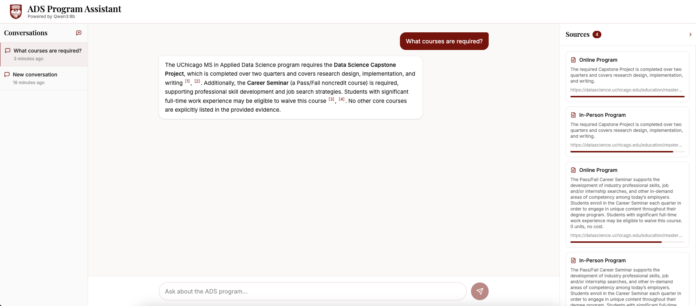

# RAG-based Interactive AI for the UChicago MSADS Website

---

## 1. Background, Purpose, and Data Source

**Background.** Prospective and current students of the University of Chicago MS in Applied Data Science (MSADS) program frequently need specific, reliable information — admission requirements, course offerings, deadlines, tuition, career outcomes — scattered across dozens of dynamically rendered web pages. A generic search or chatbot hallucinating facts is actively harmful in this context.

**Purpose.** This project builds a local, grounded question-answering agent backed by a hybrid retrieval system. The agent returns precise, cited answers sourced exclusively from the MSADS website, with no fabrication. It is designed to be run fully offline (no OpenAI dependency) using a local `qwen3:8b` model via Ollama.

**Data source.** All content is scraped from the official MSADS program site ([MSADS program](https://datascience.uchicago.edu/education/masters-programs/ms-in-applied-data-science)), covering pages on admissions, curriculum, tuition, student experience, faculty, and career outcomes — approximately 30+ pages of JavaScript-rendered HTML.

---

## 2. Methodology

### 2.1 Web Scraping

The site renders content via JavaScript, so standard `requests` + `BeautifulSoup` cannot capture accordion panels, tabs, or dynamically loaded sections. The scraper uses **Playwright** (headless Chromium) to fully render each page before extracting the DOM. Each page is saved as a raw JSON file containing the full rendered HTML and the canonical URL.

### 2.2 Knowledge Graph Construction and Chunking

Rather than flat chunking, the project builds a **DOM-aware Knowledge Graph (KG)** that mirrors the website's structural hierarchy:

```
Page → Section → TabGroup / AccordionGroup → AccordionItem → Chunk
```

Key design choices:
- **Structure is inferred from DOM roles and CSS classes**, not heading font size. This is critical because the site uses `<h2>`–`<h4>` inconsistently across pages.
- Each `Chunk` is a leaf-level text unit (target ~400 tokens) that inherits its full ancestral path (e.g. `How to Apply > Letters of Recommendation`).
- Each `Page` node stores a human-readable summary used for page-level routing.
- The KG is serialized to `index/knowledge_graph.json`; chunks to `index/chunks.json`.

### 2.3 Hybrid Retrieval

At query time, three signals are fused into a single relevance score:

| Signal | Method | Weight |
|---|---|---|
| Semantic similarity | ChromaDB + `BAAI/bge-small-en-v1.5` embeddings | primary |
| Keyword overlap | BM25 (sparse index over chunk text) | secondary |
| Structural proximity | Graph path score (chunks near KG nodes matched by query) | boost |
| Intent boost | Query-type classification (admission / tuition / course / career) | multiplicative |

All three scores are min-max normalized and summed. Top-K chunks (default 8) are returned with their full ancestral path and source URL.

### 2.4 LLM Agent Design

A single retrieval call is often insufficient — some questions require navigating to a specific page, drilling into an accordion section, or combining facts from multiple nodes. A **multi-step agent loop** is therefore used instead of a one-shot RAG pipeline.

The agent is powered by `qwen3:8b` running locally via Ollama. Each LLM call uses `/no_think` mode (thinking tokens suppressed) and `"format": "json"` for structured outputs.

**Why an agent loop instead of one-shot RAG?**
- Questions about tuition, deadlines, or prerequisites often require cross-page evidence.
- Accordion-structured content (e.g. "How to Apply" FAQs) is not surfaced by a single vector search.
- The judge step filters noise: retrieved chunks that are topically adjacent but don't directly answer the question are discarded before generation.

### 2.5 Agent Loop

```
User query
  └─► Query Rewriter          — expand/split compound questions into retrieval-ready queries
        └─► Agent Decision     — choose next tool (LLM, up to 9 steps)
              └─► Tool Execution
                    └─► Evidence Judge  — keep relevant chunks, decide if evidence is sufficient
                          └─► (loop or stop)
                                └─► Answer Generator  — synthesize cited prose from kept evidence
```

**Five agent tools:**

| Tool | Purpose |
|---|---|
| `hybrid_retrieve(query, top_k)` | Primary retrieval — always the first step |
| `list_page_summaries(query, limit)` | Identify relevant pages by description when retrieval is insufficient |
| `inspect_page(page_id)` | Show full KG structure tree of a page to locate specific nodes |
| `fetch_node_chunks(node_id, fetch_depth)` | Pull chunks from a specific KG node (e.g. an accordion item) |
| `fetch_chunk(chunk_id)` | Retrieve a single chunk's full text |

The **Evidence Judge** (a separate LLM call after each tool) decides which returned chunks to keep (`keep_chunks`) and whether accumulated evidence is sufficient to answer the question. If sufficient, the loop exits early. If not, the Agent Decision LLM chooses the next tool.

The **Answer Generator** synthesizes kept evidence into cited prose using `[1]`, `[2]` markers, building citations from evidence metadata — not from LLM text generation.

### 2.6 RAGAS Evaluation

The evaluation pipeline runs 30 curated questions against the full agent and scores four metrics via RAGAS:

| Metric | What it measures |
|---|---|
| Faithfulness | Answer is supported by retrieved context (no hallucination) |
| AnswerRelevancy | Answer addresses the actual question |
| ContextPrecision | Fraction of retrieved context that is relevant |
| ContextRecall | Retrieved context covers the reference answer |

The evaluator LLM is also `qwen3:8b` via Ollama, wrapped through LangChain. RAGAS is configured with `max_workers=1` (serial execution) to avoid request queue timeouts against a local Ollama server.

---

## 3. File Map by Execution Order

### Stage 0 — Scraping

| File | Role |
|---|---|
| [scrape.py](scrape.py) | Entry point. Uses Playwright to render each MSADS page and saves raw HTML + URL to `raw/`. |
| [docs/url_class_reference.json](docs/url_class_reference.json) | Static config listing all target URLs to scrape (the `"must"` list). Read by `scrape.py` to determine which pages to visit. |

### Stage 1 — Index Building

| File | Role |
|---|---|
| [build_index.py](build_index.py) | Entry point. Orchestrates the full offline pipeline: parse → KG build → chunk → embed → BM25 → write index. |
| [grag/kg_builder.py](grag/kg_builder.py) | Parses raw HTML into the DOM-aware KG. Assigns node types (Page, Section, AccordionItem, etc.) using CSS class heuristics, not heading size. |
| [grag/text.py](grag/text.py) | Text cleaning and token-aware chunking utilities used by `kg_builder`. |
| [grag/embeddings.py](grag/embeddings.py) | Embedding backends: `SentenceTransformerEmbedder` (default, `bge-small-en-v1.5`), `OllamaEmbedder`, `TFIDFEmbedder`. |
| [grag/chroma_store.py](grag/chroma_store.py) | Wraps ChromaDB: creates/loads the vector collection, upserts embeddings, runs similarity queries. |
| [grag/bm25.py](grag/bm25.py) | Builds and serializes the BM25 sparse index over all chunk texts. |
| [grag/index_io.py](grag/index_io.py) | Reads and writes `chunks.json`, `knowledge_graph.json`, `bm25.pkl`, `index_meta.json`. |

### Stage 2 — Retrieval Layer (standalone testing)

| File | Role |
|---|---|
| [retrieve.py](retrieve.py) | CLI script for testing hybrid retrieval without the agent. Prints top-K chunks with scores. |
| [grag/retriever.py](grag/retriever.py) | Core hybrid retrieval logic: normalizes vector + BM25 + graph scores, applies intent boost, returns ranked chunks. Imported by both `retrieve.py` and `agent/tools.py`. |
| [grag/graph_tools.py](grag/graph_tools.py) | KG navigation: `GraphNavigator` builds lookup tables (node by ID, parent/child maps, chunks by node). Used by `retriever.py` for graph scoring and by `agent/tools.py` for `inspect_page` / `fetch_node_chunks`. |

### Stage 3 — Agent

| File | Role |
|---|---|
| [agent/schemas.py](agent/schemas.py) | All dataclasses: `EvidenceItem`, `AgentMemory`, `ToolCallRecord`, `ChatResponse`, `Citation`. |
| [agent/ollama_client.py](agent/ollama_client.py) | HTTP client for Ollama (`/api/chat`). `chat_json()` enforces `"format": "json"` and strips `<think>` tokens. `chat_text()` used for free-form answer generation. |
| [agent/prompts.py](agent/prompts.py) | All LLM prompt templates: `QUERY_REWRITE_SYSTEM`, `AGENT_DECISION_SYSTEM`, `EVIDENCE_JUDGE_SYSTEM`, `ANSWER_GENERATION_SYSTEM`, and their user-turn formatters. |
| [agent/query_rewriter.py](agent/query_rewriter.py) | Calls `OllamaClient.chat_json()` with the rewrite prompt. Splits compound questions into separate retrieval queries. |
| [agent/tools.py](agent/tools.py) | `AgentTools` class wraps `grag/retriever.py` and `grag/graph_tools.py`. Implements all five agent tools and a `dispatch()` router. Formats LLM-visible result strings and caches `inspect_page` outputs for the judge. |
| [docs/page_summaries.json](docs/page_summaries.json) | Manually maintained list of page labels and plain-English descriptions for all scraped pages. Read by `agent/tools.py` to power the `list_page_summaries` tool, which lets the agent identify relevant pages before drilling into their KG structure. |
| [agent/agent_loop.py](agent/agent_loop.py) | Main loop: rewrite → decision → tool execution → judge → evidence absorption. Stops on `sufficient_evidence` or `max_tool_calls` (9). |
| [agent/answer_generator.py](agent/answer_generator.py) | Calls `OllamaClient.chat_text()` with evidence block. Extracts `[n]` citation markers via regex and builds `Citation` objects from `evidence_container` metadata. |
| [agent/logger.py](agent/logger.py) | Writes a full run log to `log/YYYY-MM-DD_HHMMSS_<run_id>.json` after each request. |

### Stage 4 — API Server

| File | Role |
|---|---|
| [app.py](app.py) | FastAPI server. `POST /chat` accepts `{query, history}` and returns `{answer, citations, debug}`. Loads `AgentTools` and `OllamaClient` once at startup via lifespan. `GET /health` reports Ollama availability. |

### Stage 5 — Evaluation

| File | Role |
|---|---|
| [eval/ragas_eval.ipynb](eval/ragas_eval.ipynb) | End-to-end RAGAS evaluation. Loads 30 curated questions from `docs/eval_queries.json`, runs the full agent on each (with file-based caching in `docs/agent_run_cache.json`), then scores Faithfulness / AnswerRelevancy / ContextPrecision / ContextRecall. Results exported to `docs/ragas_results.csv`. Includes a manual single-query test cell for qualitative inspection. |
| [docs/eval_queries.json](docs/eval_queries.json) | 30 hand-crafted evaluation questions with ground-truth answers, gold URLs, and difficulty labels across admission, curriculum, tuition, and career categories. |

---

## Frontend UI

A React + Vite single-page app under `Frontend/` provides a chat interface over the agent. The design follows UChicago's maroon palette, renders Markdown answers with clickable inline citations, and exposes the retrieved evidence in a side panel.



**Three-pane layout** (collapsing to fewer panes on narrower screens):

| Pane | Role |
|---|---|
| **Conversations** (left, hidden < 768px) | In-memory list of chat sessions. "+" creates a new one; switching preserves each conversation's messages and sources independently. State is not persisted — refresh clears everything. |
| **Chat** (center) | User messages on the right, assistant on the left. Assistant content is rendered through `react-markdown` with GFM (lists, tables, fenced code, **bold**) and a custom remark plugin that turns `[1]`, `[2]` markers into clickable superscripts. While streaming, tokens are appended into the bubble live. |
| **Sources** (right, responsive) | One card per cited evidence item — page title, full chunk text (scrollable), source URL (opens in new tab), and a relevance bar. Clicking a `[N]` marker in the chat highlights the corresponding card. On `< 768px` the panel becomes a slide-over with a floating action button. |

**Streaming protocol.** The frontend talks to `POST /chat/stream` (Server-Sent Events). Token deltas flow into the active assistant bubble; when the final `done` event arrives the answer is replaced with the server's authoritative version and the Sources panel is populated.

**Frontend file map** (under `Frontend/`):

| File | Role |
|---|---|
| [src/app/App.tsx](Frontend/src/app/App.tsx) | Top-level state — conversations, active id, loading flag — and the streaming send handler. |
| [src/app/lib/api.ts](Frontend/src/app/lib/api.ts) | `postChat` (legacy non-stream) and `postChatStream` (SSE parser) targeted at `/api/*`. |
| [src/app/components/ChatMessage.tsx](Frontend/src/app/components/ChatMessage.tsx) | Renders a single message; assistant uses `react-markdown` + `remark-gfm` + a citation remark plugin. |
| [src/app/components/SourcesPanel.tsx](Frontend/src/app/components/SourcesPanel.tsx) | Right-side sources with responsive overlay-on-mobile behavior. |
| [src/app/components/ConversationList.tsx](Frontend/src/app/components/ConversationList.tsx) | Left-side conversation switcher; in-memory only. |
| [src/app/components/ChatInput.tsx](Frontend/src/app/components/ChatInput.tsx) | Input + send button. |
| [src/app/components/WelcomeScreen.tsx](Frontend/src/app/components/WelcomeScreen.tsx) | Empty-state with suggested questions. |
| [vite.config.ts](Frontend/vite.config.ts) | Vite config with `/api` → `VITE_BACKEND_URL` (default `http://localhost:8000`) dev proxy, hiding CORS and tunnel URLs from the browser. |

---

## Quick Start

The pre-built index (`index/`, ~6 MB) is committed to the repo, so you do **not** need to run `build_index.py` unless you want to re-scrape and rebuild from scratch.

### Path A — Fully local (default)

Backend and frontend both on your laptop. Recommended if you have ≥ 16 GB RAM (qwen3:8b uses ~5–6 GB resident).

**1. Backend**

```bash
# Install Python deps
pip install -r requirements.txt

# Install + start Ollama (https://ollama.com), then pull the model
ollama pull qwen3:8b

# Run the API server
uvicorn app:app --host 0.0.0.0 --port 8000 --reload
```

The lifespan logs `[startup] Ollama available: True` and `[startup] Index loaded.` when ready.

**2. Frontend**

```bash
cd Frontend
npm install            # or `pnpm install`
npm run dev            # http://localhost:5173
```

The Vite dev server proxies `/api/*` to `http://localhost:8000` (configurable via `VITE_BACKEND_URL` — see `Frontend/.env.example`). Open the URL it prints and chat.

**3. Sanity check (optional)**

```bash
curl -X POST http://localhost:8000/chat \
  -H "Content-Type: application/json" \
  -d '{"query": "What GPA do I need to apply?", "history": []}'
```

### Path B — Backend on Colab (demo, for low-resource laptops)

Run the backend on a free Colab T4 GPU and connect a local frontend over a Cloudflare quick-tunnel. Use this when the laptop cannot host `qwen3:8b`. See `colab/README.md` for the full architecture diagram and limits.

**1. Open the notebook in Colab**

Click "Open in Colab" on `colab/run_backend.ipynb`, or visit:

```
https://colab.research.google.com/github/<owner>/<repo>/blob/main/colab/run_backend.ipynb
```

Switch the runtime to T4 GPU (*Runtime → Change runtime type → T4 GPU*) and run all cells. The first run takes ~5–10 min (mostly downloading qwen3:8b). Cell 3 prints a public URL of the form `https://<random>.trycloudflare.com`.

**2. Local frontend pointed at the Colab tunnel**

```bash
cd Frontend
npm install
VITE_BACKEND_URL=https://<random>.trycloudflare.com npm run dev
```

Open `http://localhost:5173` — Vite proxies `/api/*` to the Colab backend through the tunnel. Browser sees only `localhost`, so no CORS or mixed-content issue.

> Cloudflare quick-tunnels are ephemeral. Each Colab restart yields a new URL, so update `VITE_BACKEND_URL` and restart `npm run dev`.

### Re-building the index (only if you re-scrape)

```bash
playwright install chromium    # one-time
python scrape.py               # re-fetch HTML to raw/
python build_index.py          # rebuild KG + embeddings + BM25 (~5–10 min)
```
