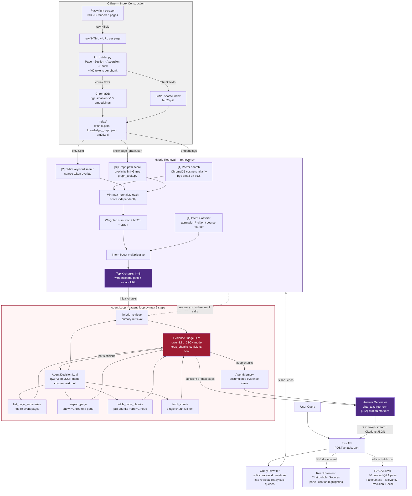
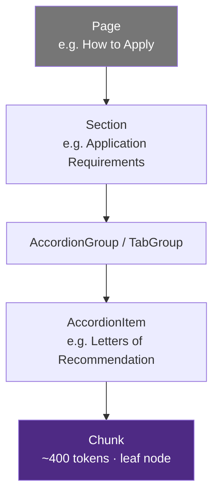
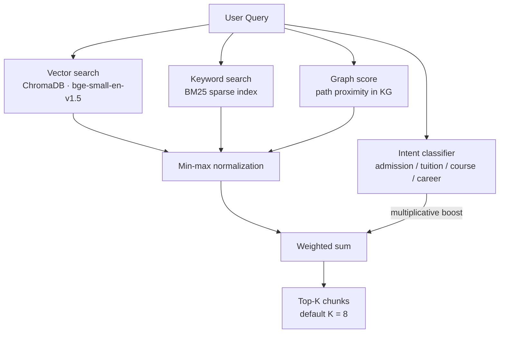
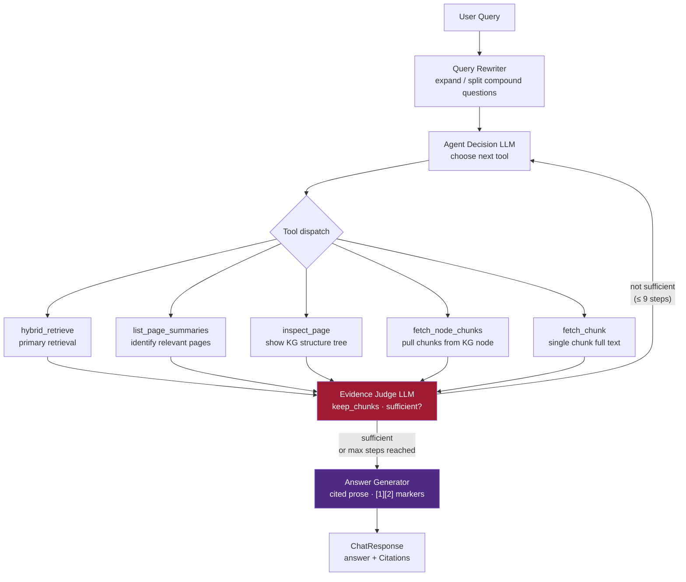
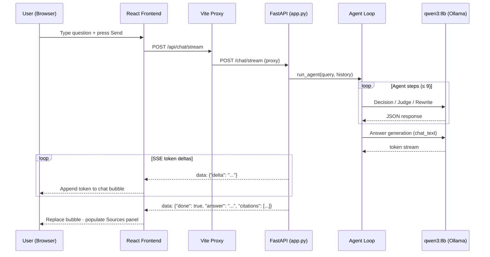
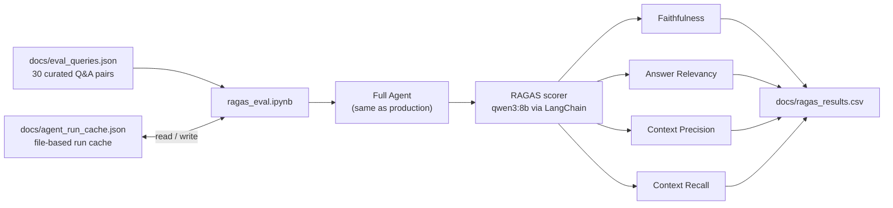
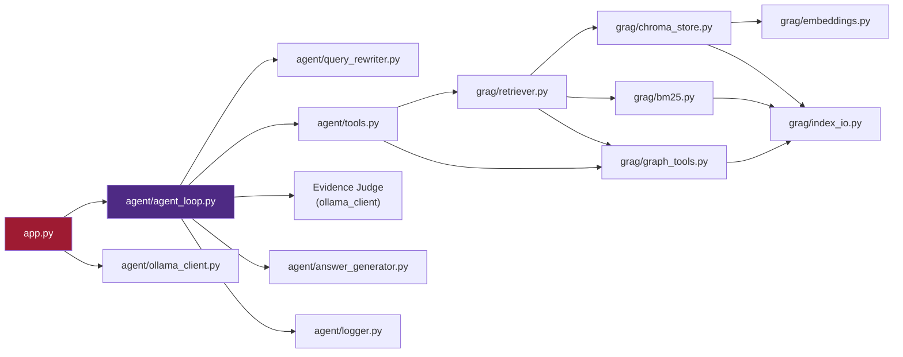

# System Overview — RAG-based Interactive AI for MSADS Website

---

## 1. End-to-End Pipeline

Data flows from offline index construction (top) into the runtime query path (bottom). Hybrid retrieval and the agent loop are expanded in full detail.

---

## 2. Knowledge Graph Structure

Content is parsed from raw HTML into a five-level DOM-aware hierarchy. Each `Chunk` is a leaf node (~400 tokens) that inherits the full ancestral path.

---

## 3. Hybrid Retrieval Score Fusion

Three signals are computed independently, min-max normalized, then summed. An intent boost is applied multiplicatively before returning top-K chunks.

---

## 4. Agent Loop

The agent iterates up to 9 tool calls. After each call the Evidence Judge decides whether to keep retrieved chunks and whether accumulated evidence is sufficient to generate an answer.

---

## 5. Frontend–Backend Communication

The React SPA talks to FastAPI over two endpoints. Streaming tokens are delivered via Server-Sent Events; citations are sent in the final `done` event.

---

## 6. RAGAS Evaluation Pipeline

---

## 7. Component Dependency Map

